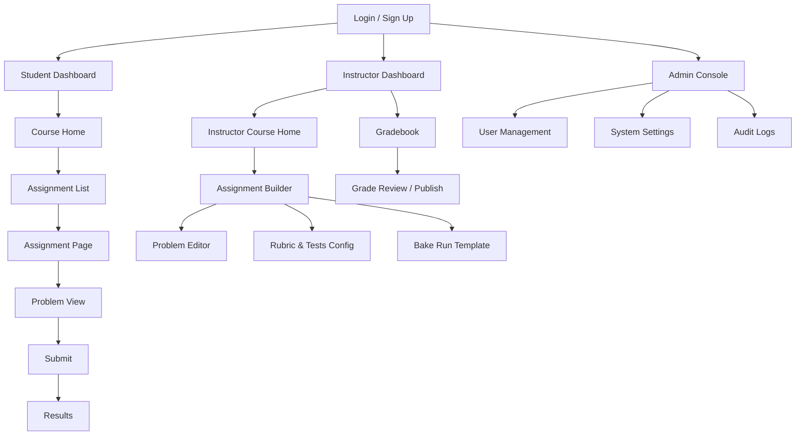

# Site Map (Frontend Pages)

## Page List & Routes
- `/login`, `/signup`
- `/dashboard` (role-aware: Student/Instructor)
- `/courses/:courseId`
- `/courses/:courseId/assignments`
- `/assignments/:assignmentId`
- `/assignments/:assignmentId/problems/:problemId`
- `/assignments/:assignmentId/submit`
- `/submissions/:submissionId` (results)
- `/instructor/courses/:courseId` (owner view)
- `/instructor/assignments/new` and `/instructor/assignments/:assignmentId/edit`
- `/instructor/gradebook/:courseId`
- `/admin/users`, `/admin/settings`, `/admin/audit`
