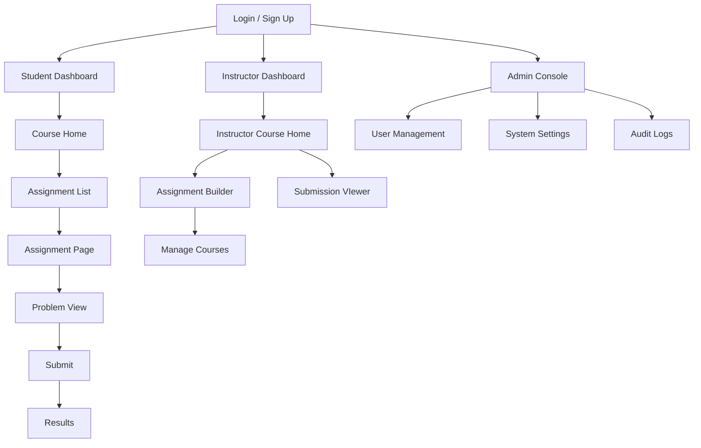

# Site Map (Frontend Pages)

```mermaid
flowchart TD
    L[Login / Sign Up] --> D[Student Dashboard]
    L --> ID[Instructor Dashboard]
    L --> AD[Admin Console]

    D --> C[Course Home]
    C --> A[Assignment List]
    A --> AP[Assignment Page]
    AP --> P[Problem View]
    P --> S[Submit]
    S --> R[Results]

    ID --> IC[Instructor Course Home]
    IC --> IA[Assignment Builder]
    IC --> IS[Submission VIewer]
    IA --> IM[Manage Courses]

    AD --> U[User Management]
    AD --> SYS[System Settings]
    AD --> AUD[Audit Logs]
```
